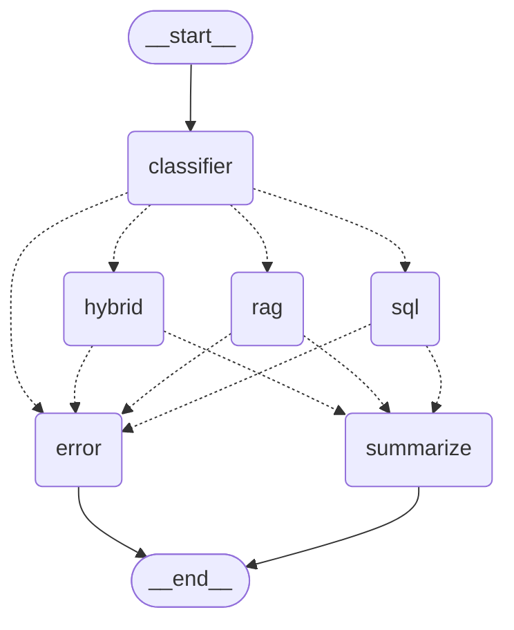

# Analytics Copilot Engine

An intelligent data assistant that acts like a smart traffic router. It automatically understands what a user is asking for and pulls the answer either from a numbers database (Postgres) or an existing document database (OpenSearch).

---

## What This Project Does

* **Intelligent Query Routing**: Evaluates user prompts to guess their intent and chooses the fastest execution path.
* **SQL Analytics Engine**: Dynamically builds and runs secure database lookup code over structured tables.
* **Upstream RAG Link**: Connects directly to the existing Milestone 02 document retrieval server for text lookups.
* **Hybrid Reasoning**: Blends structured database numbers with written file policies to answer complex business questions.
* **Cross-Turn Session Memory**: Tracks ongoing conversations and saves historical chat paths securely inside an OpenSearch index.
* **Workflow Observability**: Logs every internal "node step" and token cost to LangSmith for transparent tracking.

---

## Features

- Automated database schema detection and query assembly.
- Built-in keyword blocks stopping dangerous query commands.
- Unified multi-agent coordination using LangGraph state machines.
- Thread-scoped conversation logging matching existing session designs.
- Automatic visual graph text layout output using Mermaid code blocks.
- Complete isolated container virtualization using Docker Compose.

---

## Technologies Used


| Technology | Purpose |
|---|---|
| **Python** | Core programming language |
| **FastAPI** | Creates the network links and API web layer |
| **LangGraph** | Sets up the step-by-step workflow machine paths |
| **LangChain** | Manages foundational tool layouts and model wrappers |
| **PostgreSQL** | Storage database for sales, metrics, and business numbers |
| **OpenSearch** | Vector engine saving long-term chat memory history |
| **Amazon Bedrock (`amazon.nova-lite-v1:0`)** | Core model engine analyzing intent and parsing results |
| **Docker / Docker Compose** | Wraps the entire ecosystem into running virtual boxes |
| **LangSmith** | External logging dashboard tracking step performance |

---

## Architecture Decisions

### Why LangGraph Instead of Standard Linear Chains?
Standard AI applications process text in a single, unchangeable line. 
* It allows loops and conditional decisions based on live tool results.
* If a database error occurs, it redirects the path to an error recovery node.
* It easily splits tasks into clear, isolated execution boxes (SQL, RAG, Hybrid).

### Why a Strict Read-Only PostgreSQL Sandbox Profile?
Allowing an AI model to write database queries introduces security vectors.
* The system strips out manipulation keywords like `DROP`, `DELETE`, or `UPDATE`.
* It safely runs on a dedicated database role restricted strictly to `SELECT` privileges.
* This keeps corporate transactional tracking tables safe from wrong code logic generation.

---

## Project Structure

The project structure keeps API boundaries clearly separated [x4v8zn]:

```text
milestone-03-analytics-copilot/
│
├── app/
│   │
│   ├── api/
│   │   ├── endpoints/
│   │   │   ├── copilot_endpoint.py    # Main chat routing communication endpoint
│   │   ├── dependencies.py           # Injects configuration settings safely
│   │   └── routers.py                # Mounts prefix rules across endpoints
│   │
│   ├── core/
│   │   ├── config.py                 # Validates environmental secret credentials
│   │   ├── constants.py              # Keeps safety blacklists and hardcoded rules
│   │   └── logger.py                 # Appends live performance logs to standard files
│   │
│   ├── database/
│   │   ├── connection.py              # Creates connection lines to PostgreSQL
│   │   ├── models.py                  # Defines relational schema structure classes
│   │   └── seed_data.py               # Fills empty tables with sample transactional metrics
│   │
│   ├── graph/
│   │   ├── graph_builder.py           # Links nodes and defines workflow patterns
│   │   ├── graph_nodes.py             # Action logic written for individual engine steps
│   │   ├── graph_router.py            # Inspects sentences to pick the right path
│   │   ├── graph_state.py             # Shared memory object tracking information mid-run
│   │   └── memory.py                  # Bridges session memory into OpenSearch
│   │
│   ├── llm/
│   │   └── bedrock_client.py          # Sets up the shared Amazon Bedrock connector
│   │
│   ├── orchestration/
│   │   └── copilot_service.py         # Top-level service coordinating state calls
│   │
│   ├── schemas/
│   │   ├── chat_request.py            # Validates incoming query JSON blocks
│   │   └── chat_response.py           # Standardizes outputs before showing users
│   │
│   └── services/
│       ├── postgres_service.py        # Direct database query execution helper
│       ├── sql_agent_service.py       # Assembles metadata maps to pass to Bedrock
│       ├── rag_service.py             # Calls your existing Milestone 02 server endpoints
│       ├── insight_service.py         # Blends numbers and text for Hybrid results
│       └── chat_history_service.py    # Saves interaction text directly to OpenSearch
│   │
│   └── main.py                        # Central server initialization engine script
│
├── .dockerignore                      # Pattern map of blocks to skip during builds
├── .env                               # Target file for private database passwords
├── docker-compose.yml                 # Master settings for spinning up databases
├── Dockerfile                         # Blueprint instructions creating the app container
├── requirements.txt                   # External software tools list to download
└── README.md                          # This instructional manual guide
```

---

## Core Workflow Routing Flow

When you submit a text query, the routing machine moves the task through these evaluation stages [m8v3qp]:

```text
                             User Query
                                 ↓
                          LangGraph Router
          ┌──────────────────────┼──────────────────────┐
          │                      │                      │
       SQL Route              RAG Route            Hybrid Route
          │                      │                      │
     PostgreSQL             OpenSearch                 Both
          │                      │                      │
          └──────────────────────┴──────────────────────┘
                                 ↓
                          Final AI Response
```

### Flow Safety Mapping
If any processing errors occur mid-workflow, execution paths reroute into a clean fallback workflow:



---

## Setup & Deployment Guide

Follow these steps to download package keys and run the cluster components locally.

### 1. Fill Out the Local Variables
Create a file named **`.env`** in the application root folder and append your authentication credentials:
```env
APP_NAME="Analytics Copilot API"
APP_VERSION="1.0.0"
ENVIRONMENT="production"

AWS_ACCESS_KEY_ID="your_real_aws_access_key_id"
AWS_SECRET_ACCESS_KEY="your_real_aws_secret_access_key"
AWS_REGION="us-east-1"
BEDROCK_MODEL_ID="amazon.nova-lite-v1:0"
EMBEDDING_MODEL="all-MiniLM-L6-v2"

# Connecting to External Milestone 02 Resources
RAG_API_BASE_URL="http://docker.internal"
OPENSEARCH_HOST="host.docker.internal"
OPENSEARCH_PORT=9200
OPENSEARCH_INDEX="analytics-copilot-index"

# Databases Running Inside Docker Container Space
POSTGRES_HOST="postgres"
POSTGRES_PORT=5432
POSTGRES_DB="analytics_db"
POSTGRES_USER="admin"
POSTGRES_PASSWORD="admin"

# Monitoring and Loop Boundaries
LANGFUSE_PUBLIC_KEY="your_langfuse_public_key"
LANGFUSE_SECRET_KEY="your_langfuse_secret_key"
LANGFUSE_HOST=https://langfuse.armakuni.in

MAX_GRAPH_ITERATIONS=5
```

### 2. Build and Fire Up Your Containers
Execute these lines in your console to build code items and view running background logs:
```bash
# Build the images
docker compose build

# Boot up the server network
docker compose up
```

### 3. Check Running Application States
```bash
docker ps
```
*You should see active containers named `analytics-copilot-api` and `analytics-postgres` up on your screen.*

---

## Network Addresses

Once the health checks change to a `Healthy` state, the local services can be accessed at:

| Service Component | Interface URL | Purpose |
| :--- | :--- | :--- |
| **Streamlit User UI** | http://localhost:8501 | User chat interface & analytics logs |
| **Orchestrator Gateway Docs** | http://localhost:8050/docs | FastAPI backend interactive Swagger spec |
| **RAG Application Docs** | http://localhost:8000/docs | Data ingest & text vectorization dashboard |
| **OpenSearch Visualizer** | http://localhost:5601 | Search cluster configuration dashboard |

---

## Storage & Data Persistence

To safely save loaded datasets across computer power recycles, the configuration establishes two root volume mappings controlled by the host system daemon:
* `postgres_data` -> Persists tabular information inside database tables.
* `opensearch_data` -> Persists semantic search vector space nodes.

*Note: Avoid using the `docker compose down -v` command unless you intend to completely purge stored knowledge states and recreate database states.*

---

## Testing Scenarios

### Scenario 1: Quantitative Metrics Lookup (SQL Route)
* **User Query:** `"What is the total revenue?"`
* **Internal Behavior:** The router extracts table schemas from PostgreSQL, blocks dangerous keywords, creates an operational script, and returns real database records.
* **Response Payload Structure:**
```json
{
  "thread_id": "a918e2c3-41bb-4cd4-8894-0cf7bf1df09a",
  "route": "sql",
  "response": {
    "query": "SELECT SUM(total_amount) AS total_revenue FROM orders WHERE status = 'completed';",
    "result": [{"total_revenue": 600000.00}],
    "status": "success"
  },
  "timestamp": "2026-05-25T01:10:45.122485+00:00"
}
```

### Scenario 2: Unstructured Rule Discovery (RAG Route)
* **User Query:** `"What is the refund policy?"`
* **Internal Behavior:** The router bypasses PostgreSQL entirely and issues an HTTP POST request to the Milestone 02 application server to fetch semantic documentation fragments.
* **Response Payload Structure:**
```json
{
  "thread_id": "a918e2c3-41bb-4cd4-8894-0cf7bf1df09a",
  "route": "rag",
  "response": {
    "answer": "The refund policy allows returns within 30 days of purchase.",
    "status": "success"
  },
  "timestamp": "2026-05-25T01:12:02.441295+00:00"
}
```

### Scenario 3: Contextual Business Intelligence (Hybrid Route)
* **User Query:** `"Why are laptop sales decreasing?"`
* **Internal Behavior:** The engine fetches transaction values from PostgreSQL and matches them with product strategy briefs via the RAG client, prompting the LLM to blend *what happened* with *why it happened*.
* **Response Payload Structure:**
```json
{
  "thread_id": "a918e2c3-41bb-4cd4-8894-0cf7bf1df09a",
  "route": "hybrid",
  "response": {
    "answer": "Database records indicate laptop sales dropped by 14% this quarter (SQL). Document logs show this correlates directly with component shipping delays noted in our Q2 Supply Chain Report (RAG).",
    "status": "success"
  },
  "timestamp": "2026-05-25T01:14:18.995121+00:00"
}
```

### Scenario 4: Error Node Recovery Validation (Fallback Route)
* **User Query:** `"asdfghjkl!@#$"`
* **Internal Behavior:** The classifier detects meaningless tokens, short-circuits the pipeline, and safely steps into the error node handler to prevent database crashes or infinite loops.
* **Response Payload Structure:**
```json
{
  "thread_id": "a918e2c3-41bb-4cd4-8894-0cf7bf1df09a",
  "route": "error",
  "response": {
    "answer": "I could not verify the target intent of your request. Please rephrase your analytical question clearly.",
    "status": "fallback_triggered"
  },
  "timestamp": "2026-05-25T01:15:02.110482+00:00"
}
```

---

## 7. Conclusion

This project elevates static search frameworks into a **state-aware analytical ecosystem**. By integrating standard text routing algorithms with cyclical **LangGraph workflows**, the Analytics Copilot effectively addresses the core limitations of generic chatbots:

1. **Information Isolation:** Blends quantitative database tables with qualitative policy documents to unlock holistic hybrid analysis.
2. **Operational Safety:** Wraps standard relational tables in string filters and read-only roles to enforce firm security guardrails.
3. **Trace Observability:** Streams individual execution steps directly to LangSmith, giving developers immediate insight into execution speeds and system latency.

---
